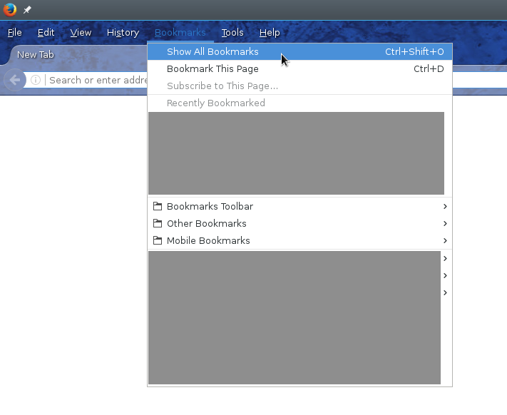

# Firefox Bookmark Normalizer

URLs are not always stable, sometimes they are changed. Websites have often
have redirects, such that your bookmarks do not become useless. The problem is
that the site that you get redirected to is no longer marked as bookmarked.
Then you might bookmark it again and have multiple bookmarks for essentially
the same page.

## Motivation

As an example, I have various YouTube bookmarks that have forms like the
following:

    http://www.youtube.com/watch?feature=player_embedded&v=xxxxxxxxxxx
    http://www.youtube.com/watch?v=xxxxxxxxxxx
    https://www.youtube.com/watch?feature=player_embedded&v=xxxxxxxxxxx#
    https://www.youtube.com/watch?v=xxxxxxxxxxx
    https://www.youtube.com/watch?v=xxxxxxxxxxx&index=xx&list=xxxxxxxxxxxxxxxxxxxxxxxxxxxxxxxxxx
    https://www.youtube.com/watch?v=xxxxxxxxxxx&list=xxxxxxxxxxxxxxxxxxxxxxxxxxxxxxxxxx
    https://www.youtube.com/watch?v=xxxxxxxxxxx([^&]+)&feature=youtu.be

The `http` and `https` difference is a problem because now everything is
redirected to `https`, which means that all `http` bookmarks are outdated. Then
there are bookmarks I created while watching the video through a playlist and
others where I got redirected from their shorter URL `youtu.be`.

I would like to have all these normalized to the canonical form:

    https://www.youtube.com/watch?v=xxxxxxxxxxx

This program takes the Firefox bookmarks and normalizes them according to the
redirects that the server has and also a set of regular expressions that can be
supplied.

## Usage

Open Firefox and go into the bookmark menu:

Then export the bookmarks as a JSON backup file:

From there you can start the script and create a new JSON file with the
transformed URLs. After that, import the new JSON file into Firefox using the
same menu.

## Dependencies

- Python 3

- Python `requests`
- Python `yaml`

## License

MIT/Expat.

<!-- vim: set spell tw=79 :-->
